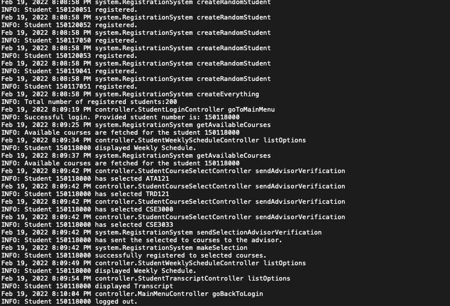

# JavaFX Practice Project
## Offline Course Registration System

### TECHNOLOGIES USED

Maven to manage the project dependencies.
Scene Builder when designing UI elements.
JavaFX to design UI and to run the simulation.
.json files to store transcripts, and weekly schedules of the students.

### APPLICATION

Created an offline course registration application where users can simulate randomly generated students.
Students in application are created randomly. Their exam scores will form a normal distribution with mean 78
and standard deviation 20. Each student is assigned a particular semester with some certain probability.
Around 1/4 of the students will be freshman, around 1/4 of the students will be semaphore etc.

To store information of the students (their transcripts, classes they took, their advisors etc.), .json files
are used. I may change it to Spring Data JPA + MySQL if needed.

### RUN OF THE SIMULATION
At first, user will have to enter a particular semester to simulate (spring/fall)

Once the user enter a semester, around 200 students will be created on the background. Each student will
have its own .json file record so, total of 200 .json files will be created in 'project/data/students/'.
Now, user will enter a students number to simulate. Entered student number should match with a student
number of a student created on the background.
Student numbers are assigned according to the regulations applied in Marmara University.
All students numbers have prefix of 150.
The next three digits of the student number represents the enterance year of the student.

120->Entrance year is 2020
119->Entrance year is 2019
118->Entrance year is 2018
117->Entrance year is 2017

The last three digits could be anything. So, 150120002, 150119020, 150117004 all are valid student numbers.
Entering a invalid student number would cause a warning prompt to pop up.

When user enters a valid number, main menu will be shown. Here, user can see his transcript, see his weekly
schedule and register for courses offered in the entered semester.

During the runtime of the application, log messages are used to inform the user. These log messages were
helpful when I was unit testing the application.

